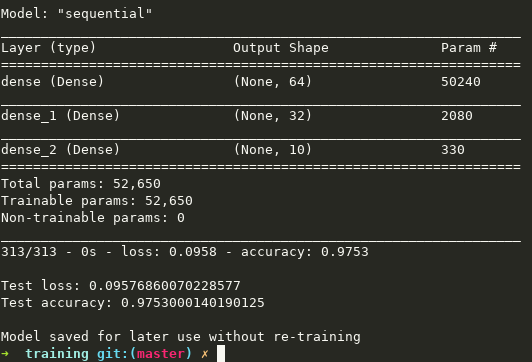
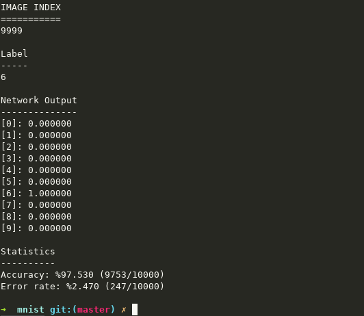

# Infercat

Proof of concept machine learning inference library for C with no extra dependency. 

Convert your tensorflow model with supported layers and activations into a C header and thats it. If you want to use other training frameworks, you should create a new export script based on current one.

## Why?

* Demystify the inference process of machine learning algorithms, starting from basics.
* Find optimal deployment scenarios for machine learning models to edge devices.

## Details

* Currently, this library only supports `DENSE`, `CONV2D`, `MAXPOOL2D` and `GRU` layers with `RELU`, `TANH`, `SIGMOID` and `SOFTMAX` activations.
* There are no dynamic memory calls in the library. All weights, biases and intermediate buffers of the layers are allocated at the compile time. 
* Only fully sequential model structures are supported. 
* For simplicity sake, current library only uses float weights and there are no hardware specific acceleration code in the kernels.

# Usage

For a complete example see `/examples/mnist` folder. It runs trough all 10000 test images and calculates accuracy metric.

## Tensorflow model creation

Crate, compile, train and export your model as follows:

```python
# ...
model = tf.keras.models.Sequential([
  tf.keras.layers.Dense(64, input_dim=784, activation='relu'),
  tf.keras.layers.Dense(32, activation='relu'),
  tf.keras.layers.Dense(10, activation='softmax')
])

# ...
model.compile(
  loss="categorical_crossentropy", 
  optimizer="adam", 
  metrics=["accuracy"]
)

# Train the model
model.fit(
  x_train, y_train, 
  batch_size=128, 
  epochs=16,
  validation_split=0.1
)

# ...
model.save('mnist_model')
```



## Tensorflow model conversion

For the conversion use `model_export.py <tensorflow_model_folder> <exported_file>` script.

As example, run `make generate_model` in the mnist example folder. This will create `mnist_model.h` file.

## Inference

There is only one method exposed to the user and that is `infercat_iterate` method. You can check [./examples/mnist/main.c](./examples/mnist/main.c) for usage.

## Performance

As you can see we can achive the same **accuracy** as tensorflow test run with mnist example and thats all that matters in terms of *correctness* for now.



# TODO

* Quantization? 8bit, 16bit?
* Speed up kernel computations by using hardware multiply accumulate intrinsics and still maintain readibility of the code?
* Rearrange weights and data structures to better suite hardware capabilities when computing?
